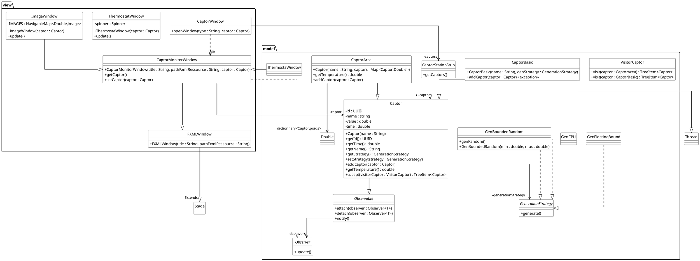

# Thermostat (via JavaFX)

:information_source: Une application qui permet de visualiser (et contrôler) un capteur de température

>  <u>Une fenêtre avec un thermostat</u> : un spinner qui affiche et changer la température du capteur 
 
<u>Une fenêtre avec une image</u> : représentant la température du capteur (pour les valeurs < 0°c on a une image de neige/glace, entre 0°c et 25°c une image de nuageux etc.)
 
De plus, si la fenêtre principale se ferme, toutes les autres fenêtres se ferment.

## Fonctionnement

## Répartition du Gitlab

La racine de mon gitlab est composée de deux doissers essentiels au projet :

[**src**](src) : **Toute la partie codage de l'application**

[**doc**](doc) : **Documentation de l'application**

## Environnement de Travail

L'environnement de travail se base sur un outil en particulier :👇

---

&nbsp; 

---

Emre KARTAL
 
© Groupe 4

