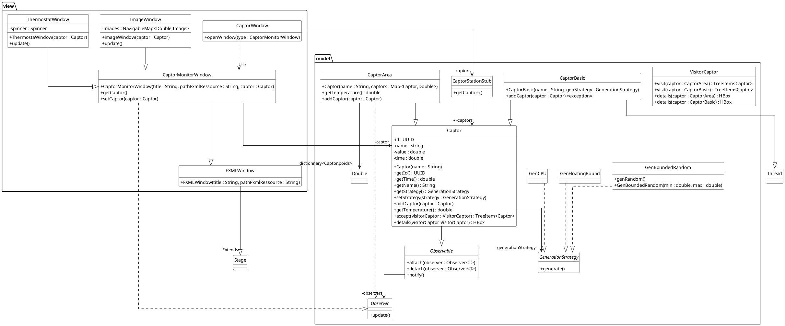

# Thermostat (via JavaFX)

:information_source: Réalisation d'une application qui permet de visualiser (et contrôler) des capteurs de température

Plus précisément, on retrouve :
>  <u>La fenêtre principale</u> : affiche la liste de tous les capteurs et lorsqu'on clique sur un capteur en particulier ces informations s'affichent.
 
<u>Une fenêtre avec un thermostat</u> : un spinner qui affiche et changer la température du capteur.
 
<u>Une fenêtre avec une image</u> : représentant la température du capteur (pour les valeurs < 0°c on a une image de neige/glace, entre 0°c et 25°c une image de nuageux, etc.).
 
De plus, si la fenêtre principale se ferme, toutes les autres fenêtres se ferment.

- ### Comment lancer le projet ? 

:information_source: *Si vous ne disposez pas d'Intellij IDEA, allé sur le site [jetbrains](https://www.jetbrains.com/idea/download/#section=windows) pour pouvoir le télécharger !!!*

Comme nous allons devoir utiliser la bibliothèque JavaFX, il va falloir l'installer, pour cela rendez-vous sur le site [Download JavaFX](https://gluonhq.com/products/javafx/) et installer sur le système d'exploitation que vous souhaitez (Windows, Linux, etc.), cependant veuillez à choisir l'architecture "x64" et le type "SDK" !

Lorsque que tout est installé, cloner le dépôt et configurer l'idea (mais aussi n'oubliez de configurer le lancement de l'application via le "launcher.main").
 
:information_source: *Pour vous aider à la configurer, vous pouvez utiliser le site [Doc JavaFX](https://openjfx.io/openjfx-docs/) !*

Lorsque tout est bon, vous pouvez lancer et profiter de l'application. :thumbsup:

## Fonctionnement

# Répartition du Gitlab

La racine de mon gitlab est composée de deux doissers essentiels au projet :

[**src**](src) : **Toute la partie codage de l'application**

[**doc**](doc) : **Documentation de l'application**

## Environnement de Travail

L'environnement de travail se base sur plusieurs outils :

---

&nbsp; 

---

Emre KARTAL
 
© Groupe 4

